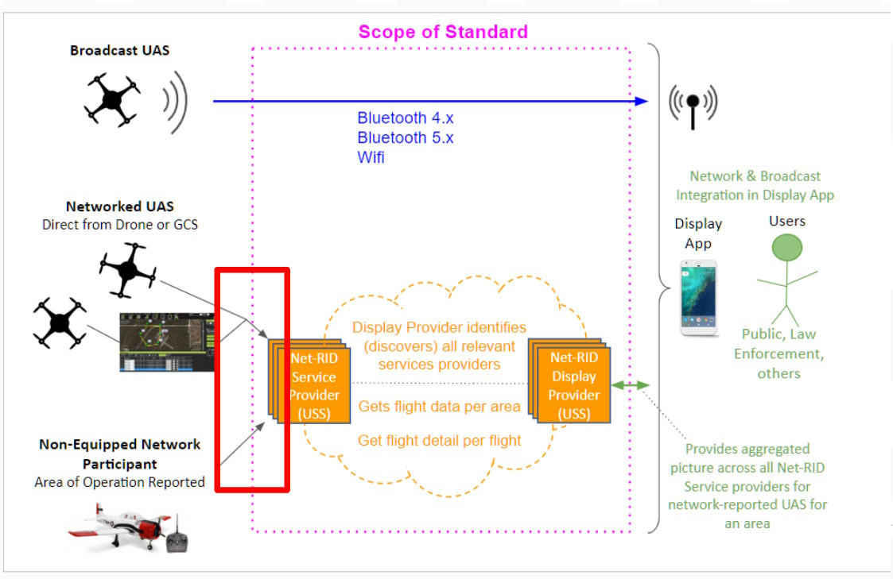

# QGCS UTM Adapter Project
## Goal
The goal of this work is to develop a UTM focused working group within Dronecode membership and build an open / configurable adapter for QGCS to enable it to exchange relevant data with a UTM system. The adapter would be configurable so that drone operators can specify what UTM system/service provider they want to use. The UTM system in turn must implement those APIs to exchange data with QGCS. 
## Scope

Figure: Image depicting the scope of ASTM Network RID standard, the part in Red: the way operators submit data to the UTM system is not standardized and we hope to build an API specification and a configurable implementation for network identification as well as other relevant data (flight authorizations, traffic information, geozones, conformance alerts etc.). 

## Deliverables

1. OpenAPI document specifying the adapter + relevant documentation of configuring adapter 
2. API to be implemented at the UTM Service Provider side
3. Implement Adapter + configuration file in QGCS that enables exchange of data with different UTM services
4. Integration of this adapter in QGCS builds + test infrastructure
 
## Timeline
- Start date: 31 May 2023 -  30 November 2023 (6 months)
- Evaluation phase: December + January 2023 / re-work

## Meetings

- :calendar: Bi-Weekly Meeting Thursdays 4:30 PM CET | 7:30 AM PT
- :link: Meeting Link: https://discord.gg/smTaq2rRVt

### June 8, 2023
**Meeting Minutes**
Hey folks, welcome to the workgroup’s first meeting; we are kicking off with an overview of the project and a goal alignment meeting.

Goal Discussion: The team agrees the main goal for the project is to build an open-source configurable adapter for QGC that can submit telemetry to participating UTM providers.

Next Steps: We are putting together data requirements for the interfaces and discussing before the meeting. The data will be distributed before the meeting starts.
